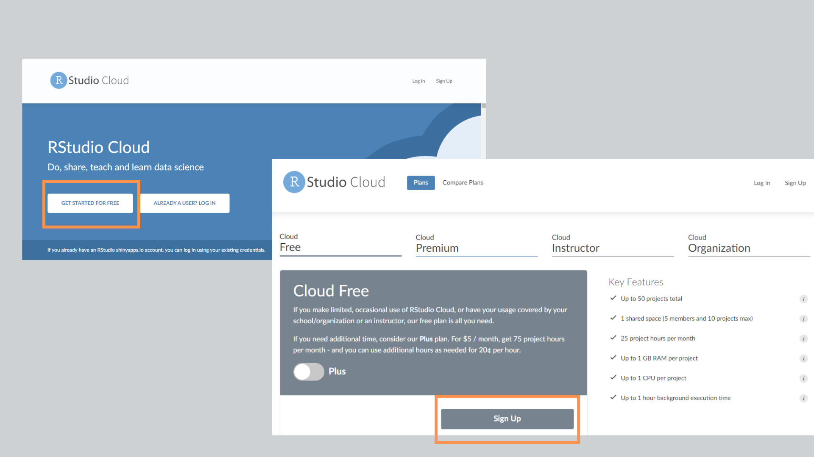
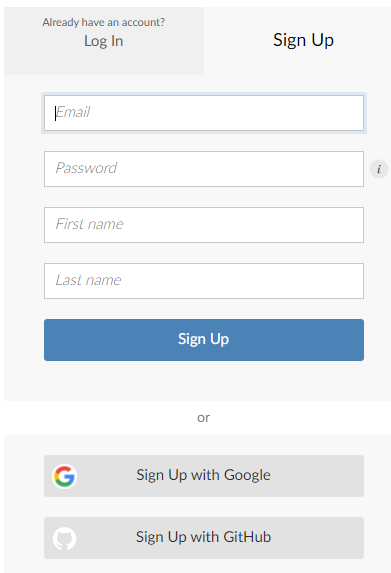
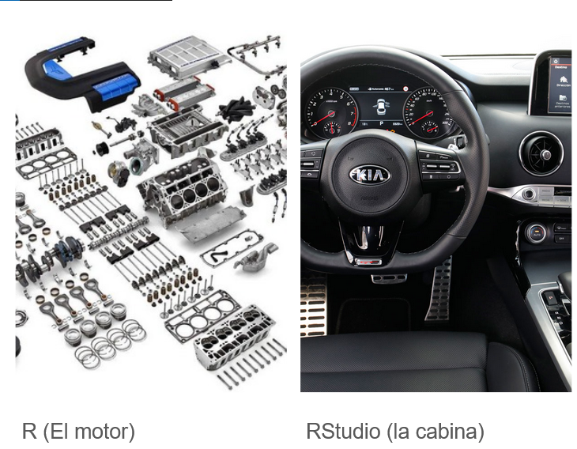
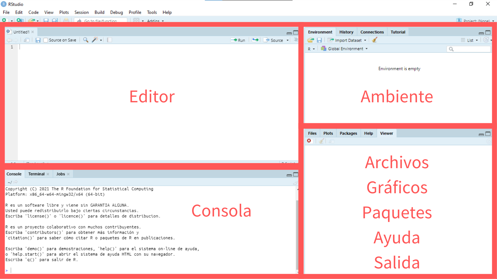
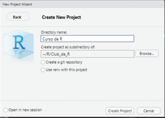
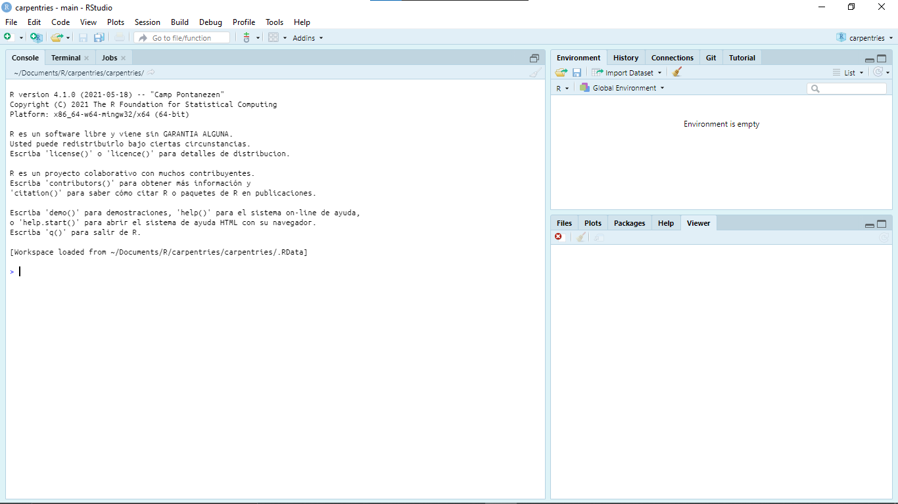
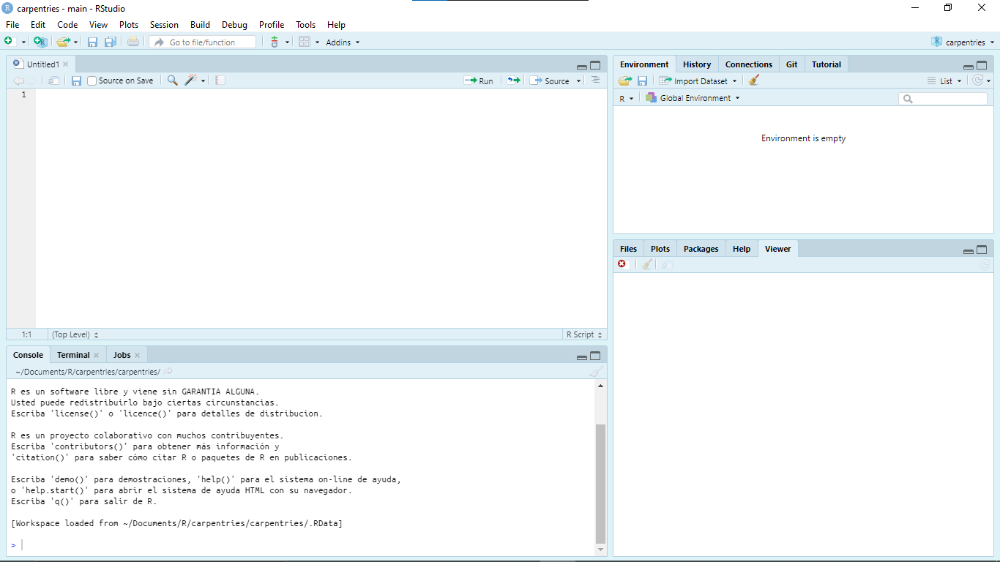

background-image: url(files/r_gen.png)
background-size: contain

```{r setup, include=FALSE}
options(htmltools.dir.version = FALSE)
knitr::opts_chunk$set(echo = TRUE, message = FALSE, warning = FALSE)
```

???

Image credit: [Canva.com](https://canva.com)

---
# ¿Qué es R?

**R** es un lenguaje de programación que permite hacer análisis de datos de manera rápida, reutilizable, y simple. Tiene una serie de soluciones para comunicar resultados en múltiples formatos que permiten que armar un informe o una presentación sea mucho más rápido y preciso porque hacés el análisis y la comunicación **en un solo lugar**.

--

Otras ventajas de R son:

* Es un lenguaje de **código abierto**.
* Su **comunidad**.
* Es **poderoso**.

--

`r emo::ji("thinking")` ¿En qué uso R?

???
Lenguaje de código abierto. Tanto R como RStudios son gratis, lo cual permite que cualquier persona en el mundo lo pueda instalar, lo que lo hace accesible para cualquier persona sin que tenga que abonar una licencia o utilizar una versión pirata e insegura del software.

R es un lenguaje ampliamente usado por todo el mundo, desde programadores hasta analistas de datos, e investigadores que permanentemente comparten contenido y desarrollan paquetes que facilitan el trabajo de cualquier usuario, y los campos de aplicación no tienen límites. 

R permite procesar grandes volúmenes de datos en poco tiempo, no requiere tener una computadora muy potente para percibir sus beneficios.

---
## Codear puede ser duro

.pull-left[
Aprender a programar es como practicar un nuevo deporte cuando tenés 40 años y han pasado décadas desde la última vez que hacías alguna actividad física.

Tenés que saber que va a ser doloroso, confuso, feo y frustrante.

Pero, también puede ser divertido. Tenes que encontrar la forma de lograr victorias rápidas que te hagan sentir que estás cosechando logros.

Y cuando tu primer código funcione, te vas a sentir así: 
]

.pull-right[

]

---
background-color: #696969
class: center, middle


---
# Instalando R y RStudio

Las alternativas más simples para trabajar con R son en la *propia computadora*, o creando una cuenta en *RStudio Cloud*.

La ventaja de trabajar en la *propia computadora* es que no dependés tanto de internet y no tenés límites en el tamaño de los archivos para usar ni tampoco en la cantidad de proyectos que podés crear.

--

La ventaja de trabajar en *RStudio Cloud* es que no necesitás preocuparte de la instalación de R o RStudio.

---
# Instalando R y RStudio
## Instalación en computadora

Para trabajar en R es ideal tener dos programas instalados. Ambos son **gratuitos**-

1. **R**: se descarga de la página de [CRAN](https://cran.r-project.org/)
2. **RStudio**: se descarga de la página de [RStudio](https://www.rstudio.com/products/rstudio/download/)

> Nota: Mostraré como instalar R y RStudio en Windows 10. Acá pueden ver un video de [instalación en Mac](https://youtu.be/sR-0BthRivY) y aquí un video de [instalación en Linux](https://youtu.be/3ni-jP2qEWg)

???

CRAN: The Comprehensive R Archive Network

---
# Instalando R y RStudio
## Crear una cuenta en la nube

Para usar RStudio en la nube tenemos que crear una cuenta en [RStudio.cloud](https://rstudio.cloud/)

.center[

]

---
# Instalando R y RStudio
## Crear una cuenta en la nube

Luego necesitamos crear una cuenta indicando email, contraseña, y nombre y apellido. También podemos asociar alguna cuenta de Google o de GitHub si lo preferimos.

.center[

]

---
# Diferencias entre R y RStudio

La analogía que mejor describe la diferencia entre R y RStudio es la siguiente:
<br>

.center[

]

---
# Los paneles de RStudio

RStudio es una interfaz que nos permite tener una mayor visibilidad y control de lo que hacemos en R y simplifica la edición de código.

.center[]

---
# Proyectos en RStudio

RStudio nos permite crear *proyectos* desde su consola. Con cada proyecto se crea una carpeta en *"Mis documentos"* en la cual podemos organizar los archivos, scripts y datos sin que necesitemos configurar manualmente todo.

Para crear un proyecto tenemos que ir al menú **Files** -> **New Project...** y en la ventana que se abre, elegir la primera opción, **New Directory**, en la siguiente ventana hacemos click en **New Project** y en la última ventana, podemos definir el nombre del proyecto y en qué carpeta guardarlo..

.pull-left[

]

.pull-left[

]

---
# Crear un primer script

.pull-left[
La primera vez que abrimos RStudio vemos 3 paneles:


]

--

.pull-right[
Creamos un script desde **File** -> **New File** -> **R Script**. Ahora tenemos 4 paneles! `r emo::ji("+1")`



]

